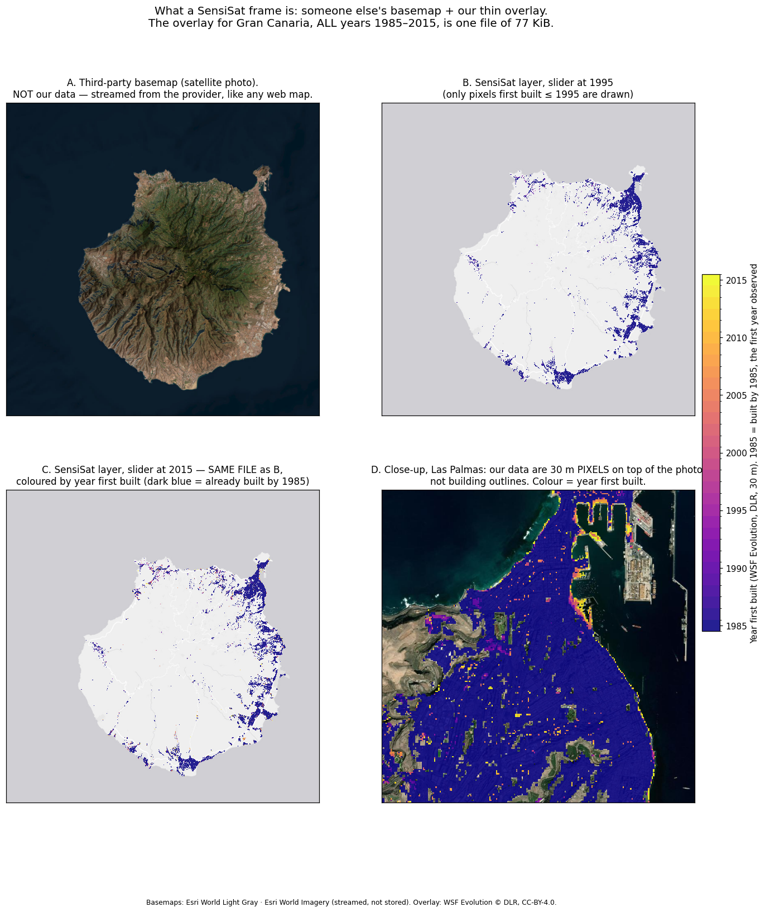
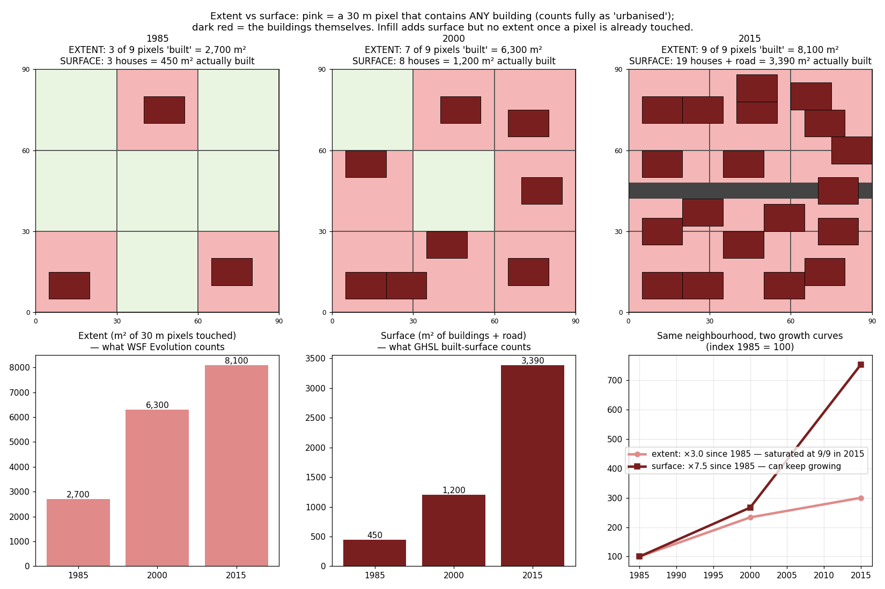
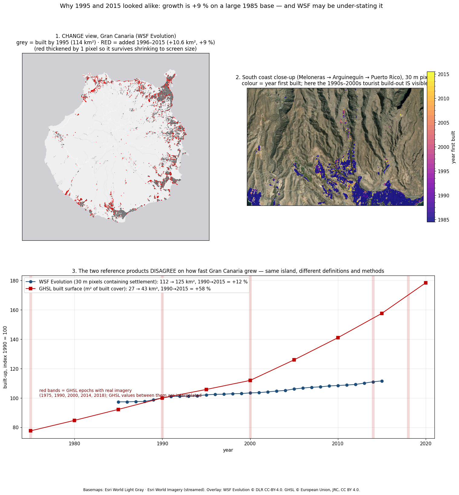

# SensiSat — concepts, explained from zero

Learning notes for the geospatial ideas this project depends on. Each section states the idea in plain
language, then shows it on real Canary Islands data where possible. Figures are generated by the scripts in
`figures/src/` (see the last section), so every number here can be reproduced.

Evidence tags: **measured** = computed from public data files by us · **verified** = read in a primary source
(dataset documentation, paper) · **estimate** = our extrapolation, arithmetic shown.

---

## 1. A map frame is two layers: someone else's basemap + our thin overlay
<!-- figures: scripts/analysis_09_sizes.py; docs/figures/data/m0_sizes.csv; docs/figures/src/preview_frame.py @ 2026-09-19 -->



A web map is a **basemap** — the background streets or satellite photo, streamed from a provider (Esri,
OpenStreetMap…) exactly as Google Maps loads its imagery — plus **overlays** drawn on top. SensiSat stores
none of the basemap. Our data are only the overlay: coloured 10–30 m pixels marking built-up land.

That is why our data are tiny. Gran Canaria at 30 m is ~160,000 land pixels, only 8 % are non-zero, and the
values are small integers in clusters. **All 31 years (1985–2015) for the whole island fit in one 77 KiB
file** (measured). DLR's own source tiles, each covering a 2° × 2° square (~200 × 220 km, mostly ocean), are
659 and 700 KiB.

We show **pixels, not building outlines** (panel D). Building outlines would be a different product —
cadastre vectors, much larger, present-day only.

Because the overlay is a single small file whose pixel value is the *year first built*, a time slider is
just a threshold applied in the browser ("show values ≤ 1995"): panels B and C are the same file. Nothing
is downloaded when the slider moves.

## 2. Pixels and resolution — the same city has different areas at 30 m and at 10 m
<!-- figures: scripts/analysis_01_totals.py; docs/figures/data/m0_totals.csv @ 2026-09-19 -->

A raster is a grid of pixels; the **resolution** is the ground size of one pixel. A 30 m pixel is
"built" if it contains *any* building, so it contributes its full 900 m² to the total even when one house
of 150 m² sits in it. At 10 m the same house touches about two pixels — 200 m². The finer the pixel,
the closer the total gets to the real footprint.

Measured on DLR's own products for the whole archipelago: WSF Evolution (30 m) says **455 km²** built by
2015; WSF2019 (10 m) says **293 km²** in 2019. Same producer, same islands, > 50 % apart purely from pixel
size. **Areas are only comparable within one resolution.**

A subtlety: WSF Evolution pixels are 0.00026949° on both axes — ~30 m north–south but only ~26.5 m
east–west at 28° N, so ~793 m² each, not 900. We use 793 m² when converting pixel counts to km².

## 3. Extent vs surface — "how much land got urbanised" vs "how much got built"
<!-- figures: scripts/analysis_01_totals.py; docs/figures/data/m0_totals.csv; docs/figures/src/extent_vs_surface.py @ 2026-09-19 -->



A synthetic 90 × 90 m neighbourhood, 3 × 3 pixels of 30 m, houses of 150 m²:

| | 1985 | 2000 | 2015 |
|---|---|---|---|
| Houses (+ road) | 3 | 8 | 19 + road |
| **Extent** — pixels touched | 3 of 9 = 2,700 m² | 7 of 9 = 6,300 m² | 9 of 9 = 8,100 m² |
| **Surface** — m² actually built | 450 m² | 1,200 m² | 3,390 m² |
| Growth since 1985 | — | — | extent ×3.0 · surface ×7.5 |

Already in 1985 extent overstates the footprint six-fold (2,700 m² against 450 m²). By 2015 every pixel is touched, so **extent
cannot grow any more** — yet infill keeps adding surface. From then on an extent product reports zero
growth for this neighbourhood forever.

- **Extent** answers *how much land got urbanised* — which plots stopped being natural or agricultural
  land. This is the **ecological** question (habitat lost, landscape fragmented). It depends strongly on
  pixel size (section 2). WSF Evolution and WSF Tracker are extent products.
- **Surface** answers *how much got built* — sealed area, the physical stock. This is the **planning**
  question (runoff, heat island, housing, infrastructure demand). It registers densification, and it is
  the only measure that would register a demolition inside an already-dense pixel. GHSL built surface
  (m² per 100 m cell) and Copernicus Imperviousness (% sealed per pixel) are surface products.

On real data (Gran Canaria, 1990 → 2015, same island polygon for both, measured): **WSF Evolution
extent +11 %** (112.7 → 125.5 km²); **GHSL built surface +57 %** (27.5 → 43.3 km²).

But Gran Canaria is not the rule — measured across all eight islands, **the gap reverses direction
depending on how densely built the island already is**:

| island | extent (WSF) | surface (GHSL) | |
|---|---:|---:|---|
| Gran Canaria | +11 % | +57 % | dense: extent saturated in 1990, infill adds surface only |
| Tenerife | +10 % | +13 % | dense |
| La Palma / La Gomera | +17 / +18 % | +15 / +15 % | balanced |
| Lanzarote | +183 % | +192 % | balanced |
| Fuerteventura | +400 % | +162 % | sparse: each new building lights a whole 30 m pixel |
| La Graciosa | +620 % | +285 % | sparse |

In an already-urbanised island the pixels are switched on long ago, so extent stalls while surface keeps
climbing. In a sparsely developing one the opposite happens: scattered new buildings each claim a whole
coarse pixel while adding little real cover, so extent outruns surface. Neither product is wrong, and
reporting only one would misrepresent whichever half of the archipelago it suits less. SensiSat reports
both, each with its definition attached. The **fraction grid** — share of each 100 m cell that is built —
is the bridge: summing fractions gives surface; counting cells above a threshold gives extent.

## 4. State view vs change view — why two frames can look identical
<!-- figures: scripts/analysis_01_totals.py; docs/figures/data/m0_totals.csv; docs/figures/src/change_view.py @ 2026-09-19 -->



Between 1995 and 2015 WSF Evolution adds 10.7 km² to a base of 114 km² (+9 %). Two side-by-side
"state" maps are then 91 % identical by construction, and at island scale one 30 m pixel of new growth is
*smaller than a screen pixel* and blends away. A **change map** draws only the difference (grey = existed,
red = added) and the growth becomes visible. The viewer therefore needs two modes: "state at year X"
and "added since year X".

## 5. The first frame of a time series is a baseline, not a growth year
<!-- figures: scripts/analysis_01_totals.py; docs/figures/data/m0_totals.csv; external:GHSL P2016 BUILT_LDSMT_GLOBE_V1 read in Earth Engine during the prototype, 2026-09-18 — no output was kept, so the 71 / +0.0 / +3.4 km² figures are not reproducible from this repository @ 2026-09-19 -->

WSF Evolution starts in 1985 and its first value means "already built by 1985" — centuries of Las Palmas
history collapsed into one class. On Gran Canaria it puts **108.6 of 124.6 km² (87 %) in that baseline**
(measured). The older GHSL extent product (P2016, 38 m) goes one step further: **71 km² "built by 1975",
then +0.0 km² for 1975–1990 and 1990–2000, +3.4 km² for 2000–2014** (measured in Earth Engine) — which is
not credible for an island whose tourism build-out happened exactly then. Early Landsat imagery
(60–80 m before 1984) confuses bare dry soil with settlement, so front-loaded baselines are a known
risk. Whether Gran Canaria really was 87 % "done" by 1985 is a question M0 tests against the cadastre
(HISDAC-ES construction years) and 1980s orthophotos, not something to assume.

## 6. Growth-only products cannot show loss
<!-- figures: scripts/analysis_01_totals.py; external:JRC GHSL Data Package 2023 @ 2026-09-19 -->

GHSL's method works backwards in time and, per JRC's Data Package 2023, "by definition… can only decrease
the amount of built-up surface going from recent to past epochs" — i.e. forward in time it never falls
(verified). Measured over Gran Canaria: cells decreasing 2010→2015: **0**; 2015→2020: **0**. WSF Evolution
excludes all pixels that are non-settlement in 2015 (verified). Neither can show a demolition or the La
Palma 2021 lava burial. Only products that record the *state at each date* (Copernicus Imperviousness
2018/2021/2024 and its Built-up Change layer, Esri annual LULC) can — and their loss signal must first be
separated from classification noise.

GHSL epochs with real imagery are **1975, 1990, 2000, 2014 (Landsat) and 2018 (Sentinel-2)**; all other
5-year epochs are interpolated, 2025/2030 extrapolated (verified).

## 7. Three products, three numbers — the same island
<!-- figures: scripts/analysis_01_totals.py; docs/figures/data/m0_totals.csv; docs/figures/data/m0_corine_2018.csv; geeLocalTesting @ 2026-09-19 -->

| Product | What a "built" value means | Gran Canaria, ~2015–2020 |
|---|---|---|
| GHSL built surface | m² of actual built cover inside each 100 m cell | 43–49 km² |
| WSF Evolution | 30 m pixels containing *any* settlement | 126 km² |
| Dynamic World (our first prototype) | 10 m pixels labelled built, incl. "urban open space" | 308 km² |

A 6× spread from definition and pixel size alone. Official statistics put artificial land near 6 % of the
Canaries (partial); Dynamic World's 308 km² is ~20 % of Gran Canaria, and its 23 km² of 2016→2025 "loss"
has no real-world counterpart — classification flicker. A number like "20 % urban" means nothing without
its definition.

## Regenerating the figures
<!-- figures: docs/figures/src/preview_frame.py; docs/figures/src/m0_results.py @ 2026-09-19 -->

```bash
pip install rasterio matplotlib numpy scipy pillow requests
python docs/figures/src/extent_vs_surface.py      # synthetic, no downloads
python docs/figures/src/preview_frame.py          # downloads two DLR tiles (~1.4 MB) into data/raw/, streams basemap tiles
python docs/figures/src/change_view.py            # same tiles + docs/figures/data/ghsl_*.json (from Earth Engine)
```

Sources: DLR WSF Evolution `download.geoservice.dlr.de/WSF_EVO` (CC-BY-4.0) · JRC GHSL R2023A and P2016 via
Earth Engine (`JRC/GHSL/P2023A/GHS_BUILT_S`, `JRC/GHSL/P2016/BUILT_LDSMT_GLOBE_V1`), CC BY 4.0 · JRC GHSL
Data Package 2023 report · Basemaps streamed from Esri (World Imagery, World Light Gray) for the figures only.
