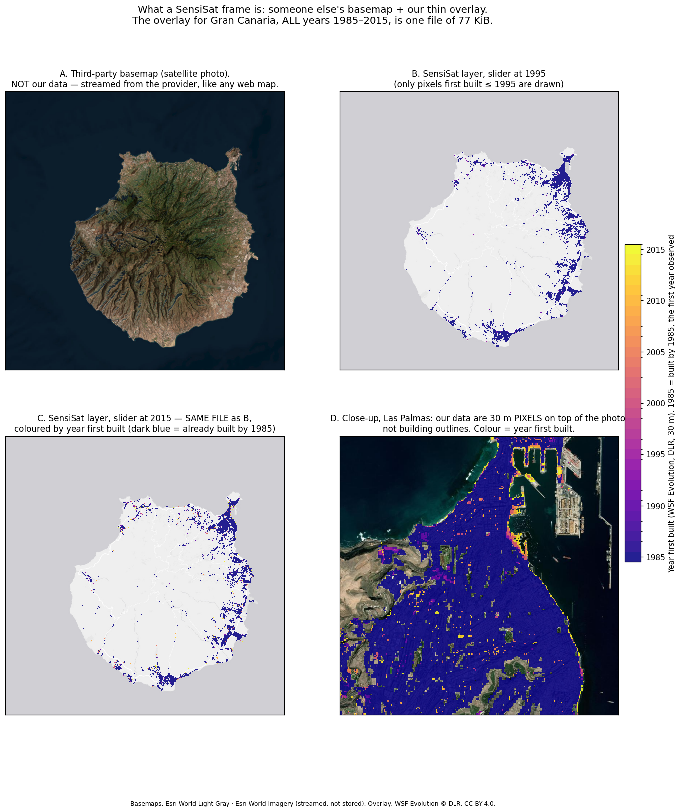
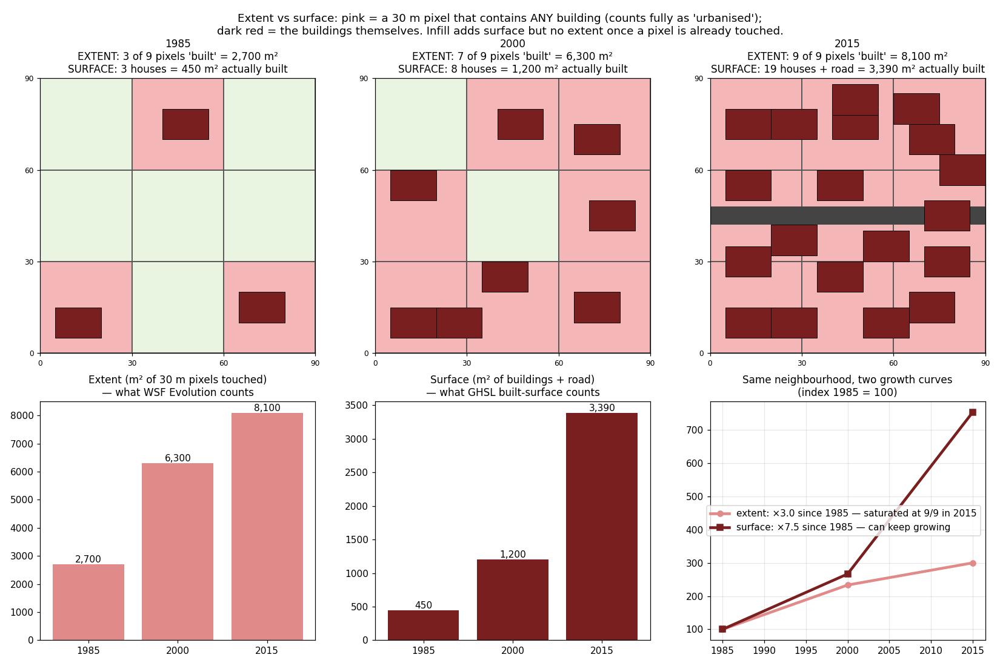
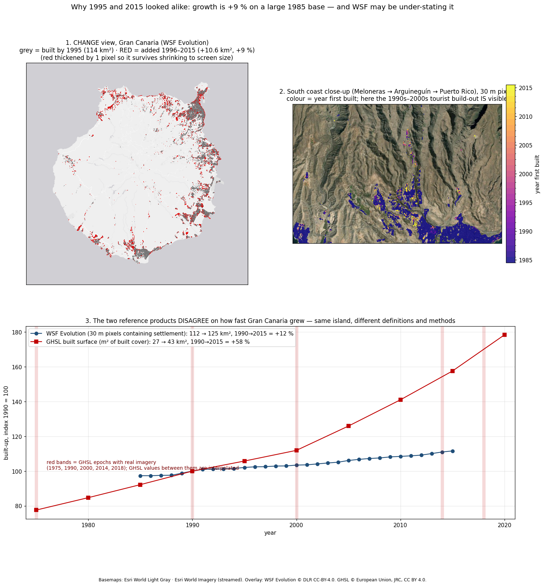

# SensiSat — concepts, explained from zero

Learning notes for the geospatial ideas this project depends on. Each section states the idea in plain
language, then shows it on real Canary Islands data where possible. Figures are generated by the scripts in
`figures/src/` (see the last section), so every number here can be reproduced.

Evidence tags: **measured** = computed from public data files by us · **verified** = read in a primary source
(dataset documentation, paper) · **estimate** = our extrapolation, arithmetic shown.

---

## 1. A map frame is two layers: someone else's basemap + our thin overlay
<!-- figures: scripts/analysis_09_sizes.py; docs/figures/data/m0_sizes.csv; docs/figures/src/preview_frame.py; scripts/analysis_01_totals.py; docs/figures/data/m0_totals.csv @ 2026-09-19 -->



A web map is a **basemap** — the background streets or satellite photo, streamed from a provider (Esri,
OpenStreetMap…) exactly as Google Maps loads its imagery — plus **overlays** drawn on top. SensiSat stores
none of the basemap. Our data are only the overlay: coloured 10–30 m pixels marking built-up land.

That is why our data are tiny. Gran Canaria at 30 m is ~2 million land pixels (1,566 km² of island at ~793 m²
a pixel, §2), only 8 % of them — ~160,000 — are non-zero, and the values are small integers in clusters. **All 31 years (1985–2015) for the whole island fit in one 77 KiB
file** (measured). DLR's own source tiles, each covering a 2° × 2° square (~200 × 220 km, mostly ocean), are
659 and 700 KiB.

We show **pixels, not building outlines** (panel D). Building outlines would be a different product —
cadastre vectors, much larger, present-day only.

Because the overlay is a single small file whose pixel value is the *year first built*, a time slider is
just a threshold applied in the browser ("show values ≤ 1995"): panels B and C are the same file. Nothing
is downloaded when the slider moves.

## 2. Pixels and resolution — the same city has different areas at 30 m and at 10 m
<!-- figures: scripts/analysis_01_totals.py; docs/figures/data/m0_totals.csv; measured:first archipelago totals of WSF Evolution and WSF 2019, 2026-09-19, before analysis 1 — scope not recorded, no script survives @ 2026-09-19 -->

A raster is a grid of pixels; the **resolution** is the ground size of one pixel. A 30 m pixel is
"built" if it contains *any* building, so it contributes its full 900 m² to the total even when one house
of 150 m² sits in it. At 10 m the same house touches about two pixels — 200 m². The finer the pixel,
the closer the total gets to the real footprint.

Measured on DLR's own products for the whole archipelago: WSF Evolution (30 m) says **455 km²** built by
2015; WSF2019 (10 m) says **293 km²** in 2019. Same producer, same islands, > 50 % apart purely from pixel
size. **Areas are only comparable within one resolution.** (Those two are the project's first measurement,
taken before analysis 1 existed, over a scope that was not recorded, and no surviving script reproduces them.
Analysis 1 clips both products to the same island land polygons and gives **376.9** and **230.4 km²** — the
figures in the ladder of definitions in `data-evaluation.md` §6f — and the same lesson: 64 % apart.)

A subtlety: WSF Evolution pixels are 0.00026949° on both axes — ~30 m north–south but only ~26.5 m
east–west at 28° N, so ~793 m² each, not 900. We use 793 m² when converting pixel counts to km².

## 3. Extent vs surface — "how much land got urbanised" vs "how much got built"
<!-- figures: scripts/analysis_01_totals.py; docs/figures/data/m0_totals.csv; docs/figures/src/extent_vs_surface.py @ 2026-09-19 -->



A synthetic 90 × 90 m neighbourhood, 3 × 3 pixels of 30 m, houses of 150 m²:

| | 1985 | 2000 | 2015 |
|---|---|---|---|
| Houses (+ road) | 3 | 8 | 19 + road |
| **Extent** — pixels touched | 3 of 9 = 2,700 m² | 7 of 9 = 6,300 m² | 9 of 9 = 8,100 m² |
| **Surface** — m² actually built | 450 m² | 1,200 m² | 3,390 m² |
| Growth since 1985 | — | — | extent ×3.0 · surface ×7.5 |

Already in 1985 extent overstates the footprint six-fold (2,700 m² against 450 m²). By 2015 every pixel is touched, so **extent
cannot grow any more** — yet infill keeps adding surface. From then on an extent product reports zero
growth for this neighbourhood forever.

- **Extent** answers *how much land got urbanised* — which plots stopped being natural or agricultural
  land. This is the **ecological** question (habitat lost, landscape fragmented). It depends strongly on
  pixel size (section 2). WSF Evolution and WSF Tracker are extent products.
- **Surface** answers *how much got built* — sealed area, the physical stock. This is the **planning**
  question (runoff, heat island, housing, infrastructure demand). It registers densification, and it is
  the only measure that would register a demolition inside an already-dense pixel. GHSL built surface
  (m² per 100 m cell) and Copernicus Imperviousness (% sealed per pixel) are surface products.

On real data (Gran Canaria, 1990 → 2015, same island polygon for both, measured): **WSF Evolution
extent +11 %** (112.7 → 125.5 km²); **GHSL built surface +57 %** (27.5 → 43.3 km²).

But Gran Canaria is not the rule — measured across all eight islands, **the gap reverses direction
depending on how densely built the island already is**:

| island | extent (WSF) | surface (GHSL) | |
|---|---:|---:|---|
| Gran Canaria | +11 % | +57 % | dense: extent saturated in 1990, infill adds surface only |
| Tenerife | +10 % | +13 % | dense |
| La Palma / La Gomera | +17 / +18 % | +15 / +15 % | balanced |
| Lanzarote | +183 % | +192 % | balanced |
| Fuerteventura | +400 % | +162 % | sparse: each new building lights a whole 30 m pixel |
| La Graciosa | +620 % | +285 % | sparse |

In an already-urbanised island the pixels are switched on long ago, so extent stalls while surface keeps
climbing. In a sparsely developing one the opposite happens: scattered new buildings each claim a whole
coarse pixel while adding little real cover, so extent outruns surface. Neither product is wrong, and
reporting only one would misrepresent whichever half of the archipelago it suits less. SensiSat reports
both, each with its definition attached. The **fraction grid** — share of each 100 m cell that is built —
is the bridge: summing fractions gives surface; counting cells above a threshold gives extent.

## 4. State view vs change view — why two frames can look identical
<!-- figures: scripts/analysis_01_totals.py; docs/figures/data/m0_totals.csv; docs/figures/src/change_view.py @ 2026-09-19 -->



Between 1995 and 2015 WSF Evolution adds 10.7 km² to a base of 114 km² (+9 %). Two side-by-side
"state" maps are then 91 % identical by construction, and at island scale one 30 m pixel of new growth is
*smaller than a screen pixel* and blends away. A **change map** draws only the difference (grey = existed,
red = added) and the growth becomes visible. The viewer therefore needs two modes: "state at year X"
and "added since year X".

## 5. The first frame of a time series is a baseline, not a growth year
<!-- figures: scripts/analysis_01_totals.py; docs/figures/data/m0_totals.csv; external:GHSL P2016 BUILT_LDSMT_GLOBE_V1 read in Earth Engine during the prototype, 2026-09-18 — no output was kept, so the 71 / +0.0 / +3.4 km² figures are not reproducible from this repository @ 2026-09-19 -->

WSF Evolution starts in 1985 and its first value means "already built by 1985" — centuries of Las Palmas
history collapsed into one class. On Gran Canaria it puts **108.6 of 124.6 km² (87 %) in that baseline**
(measured). The older GHSL extent product (P2016, 38 m) goes one step further: **71 km² "built by 1975",
then +0.0 km² for 1975–1990 and 1990–2000, +3.4 km² for 2000–2014** (measured in Earth Engine) — which is
not credible for an island whose tourism build-out happened exactly then. Early Landsat imagery
(60–80 m before 1984) confuses bare dry soil with settlement, so front-loaded baselines are a known
risk. Whether Gran Canaria really was 87 % "done" by 1985 is a question M0 tests against the cadastre
(HISDAC-ES construction years) and 1980s orthophotos, not something to assume.

## 6. Growth-only products cannot show loss
<!-- figures: scripts/analysis_01_totals.py; external:JRC GHSL Data Package 2023 @ 2026-09-19 -->

GHSL's method works backwards in time and, per JRC's Data Package 2023, "by definition… can only decrease
the amount of built-up surface going from recent to past epochs" — i.e. forward in time it never falls
(verified). Measured over Gran Canaria: cells decreasing 2010→2015: **0**; 2015→2020: **0**. WSF Evolution
excludes all pixels that are non-settlement in 2015 (verified). Neither can show a demolition or the La
Palma 2021 lava burial. Only products that record the *state at each date* (Copernicus Imperviousness
2018/2021/2024 and its Built-up Change layer, Esri annual LULC) can — and their loss signal must first be
separated from classification noise.

GHSL epochs with real imagery are **1975, 1990, 2000, 2014 (Landsat) and 2018 (Sentinel-2)**; all other
5-year epochs are interpolated, 2025/2030 extrapolated (verified).

## 7. Three products, three numbers — the same island
<!-- figures: scripts/analysis_01_totals.py; docs/figures/data/m0_totals.csv; docs/figures/data/m0_corine_2018.csv; geeLocalTesting @ 2026-09-19 -->

| Product | What a "built" value means | Gran Canaria, ~2015–2020 |
|---|---|---|
| GHSL built surface | m² of actual built cover inside each 100 m cell | 43–49 km² |
| WSF Evolution | 30 m pixels containing *any* settlement | 126 km² |
| Dynamic World (our first prototype) | 10 m pixels labelled built, incl. "urban open space" | 308 km² |

A 6× spread from definition and pixel size alone. Official statistics put artificial land near 6 % of the
Canaries (partial); Dynamic World's 308 km² is ~20 % of Gran Canaria, and its 23 km² of 2016→2025 "loss"
has no real-world counterpart — classification flicker. A number like "20 % urban" means nothing without
its definition.

## 8. Coordinate systems — why "10 m" pixels are not 10 m, and why everything lands on one grid
<!-- figures: sensisat/grid.py; sensisat/config.py; sensisat/layers.py; external:the UTM zone scheme and the ±180° antimeridian, EPSG/OGC definitions — general reference, not measured here @ 2026-10-06 -->

A **coordinate reference system** (CRS) is the rule that turns a place on the round
Earth into a pair of numbers. There are two families, and the difference is the source
of a whole class of quiet error.

- **Geographic** systems give **degrees** of latitude and longitude. **EPSG:4326** —
  "EPSG" is just the catalogue the numbers come from — is the familiar one, the
  lat/lon a phone reports. One system covers the whole planet, with no zone
  boundaries to cross — though longitude still wraps at the antimeridian (the
  ±180° line), which anything crossing the Pacific must handle explicitly and the
  Canaries, at 18.5°W to 13.2°W, never approach.
- **Projected** systems give **metres on a flat sheet**, by choosing how to flatten
  the curved surface. **EPSG:3035** is one built for Europe, **EPSG:32628** is UTM
  zone 28 N — *Universal Transverse Mercator* slices the globe into 60 north–south
  strips, each 6° of longitude wide, and flattens each one separately; 28 N is the
  strip the Canaries fall in. Distances behave like distances, but each
  projection is only accurate over the region it was designed for.

Every flattening distorts something — area, angle, or distance — and no projection
avoids all three. That is why there are thousands of them rather than one.

**Why this project cares.** Our seven layers come from five producers in *three*
different systems: WSF is 4326, Copernicus is 3035, the cadastre is 32628. On their
own grids, two layers of the same island do not line up pixel-for-pixel, so the viewer
cannot stack them and the quality gates cannot compare them without *resampling* at
every comparison — recomputing a raster's values onto a different grid, which has to
invent a value wherever the new cell does not line up with an old one. And
**resampling a category is how a date nothing happened gets invented**
(CLAUDE.md #5). So everything is converted **once**, at build time, onto one shared
grid. Afterwards two layers have byte-identical shapes and `a & b` is a real question
about one piece of ground.

**Which grid, and what it cost.** WSF Tracker's own grid, unchanged: it is EPSG:4326,
which four of the seven layers already use, and it is the native grid of era-b, the
layer carrying 2016 to today — the one we least want to disturb. Web maps expect
degrees or Web Mercator anyway, so a metric grid would have to be converted for display
regardless. The price is that Copernicus is reprojected once here rather than never;
`sensisat/grid.py` records the trade and the STAC item records that it happened.

**The trap that follows from choosing degrees.** A pixel on this grid is a fixed number
of *degrees* on both axes, and a degree of longitude shrinks as you move away from the
equator, because the meridians (the lines of longitude, which run pole to pole)
converge as they approach the poles. So a "10 m" pixel is not a 10 m square:

<!--[[[cog
from sensisat import facts as f
from sensisat.config import CANARIES_BBOX
from sensisat.grid import NOMINAL_M, PIXEL_DEG

south, north = CANARIES_BBOX[1], CANARIES_BBOX[3]   # the archipelago's own latitude span
ns, ew_s, _ = f.pixel_metres(south)
_, ew_n, _ = f.pixel_metres(north)
a_n, a_s = f.pixel_area_range()
lo_pct, hi_pct = f.pixel_area_overstatement()
nominal = NOMINAL_M ** 2
cog.outl(
    f"> one pixel = **{PIXEL_DEG:.3e} degrees** on each axis — a constant, everywhere\n"
    f"> north–south that is **{ns:.2f} m** at every latitude\n"
    f"> east–west it is **{ew_s:.2f} m** at {south:.1f} °N (south of El Hierro) and "
    f"**{ew_n:.2f} m** at {north:.1f} °N (north of Lanzarote)\n"
    f"> so one pixel covers **{a_n:.1f}–{a_s:.1f} m²** across the archipelago, "
    f"never the nominal {nominal:.0f} m²"
)
cog.outl(
    f"\nCall a pixel {nominal:.0f} m² and you claim {nominal:.0f} where "
    f"{a_n:.1f}–{a_s:.1f} stands, so **every area comes out "
    f"{lo_pct:.0f} %–{hi_pct:.0f} % too large** "
    f"({nominal:.0f} ÷ {a_s:.1f} = {nominal / a_s:.3f}; {nominal:.0f} ÷ {a_n:.1f} = "
    f"{nominal / a_n:.3f}), and the error grows the further north you go. Watch the "
    f"denominator: the same error is {(1 - a_s / nominal) * 100:.0f} %–{(1 - a_n / nominal) * 100:.0f} % "
    f"of the *claimed* total, which is the smaller-looking way to say the same thing "
    f"and how CLAUDE.md #2 states it."
)
]]]-->
> one pixel = **8.983e-05 degrees** on each axis — a constant, everywhere
> north–south that is **9.98 m** at every latitude
> east–west it is **8.87 m** at 27.5 °N (south of El Hierro) and **8.69 m** at 29.6 °N (north of Lanzarote)
> so one pixel covers **86.8–88.6 m²** across the archipelago, never the nominal 100 m²

Call a pixel 100 m² and you claim 100 where 86.8–88.6 stands, so **every area comes out 13 %–15 % too large** (100 ÷ 88.6 = 1.129; 100 ÷ 86.8 = 1.152), and the error grows the further north you go. Watch the denominator: the same error is 11 %–13 % of the *claimed* total, which is the smaller-looking way to say the same thing and how CLAUDE.md #2 states it.
<!--[[[end]]]-->

## 9. How the data are published: COG and STAC — the reason there is no server
<!-- figures: sensisat/raster.py; sensisat/layers.py; docs/pipeline.md @ 2026-09-30 -->

A **GeoTIFF** is an ordinary TIFF image carrying, in its header, where on Earth each
pixel sits and in which CRS (§8). A **Cloud-Optimized GeoTIFF (COG)** is the same
image with its bytes *deliberately ordered* so a reader that cannot open the file
locally can still read part of it over the network.

Three properties make that work:

- **Tiling.** The image is stored as independent square blocks rather than row by row,
  so a reader can fetch one block without the rest. A block is the smallest thing that
  can be read, so it is also the unit the viewer's cost is paid in — which is why its
  near/far threshold is counted in blocks, not in pixels (`docs/viewer.md`).
- **Overviews.** Pre-shrunk copies of the whole image live inside the same file, so a
  zoomed-out view reads a small overview instead of decoding everything.
- **Byte order.** Header first, then the overviews, *then* the full-resolution image.
  A reader fetches the header, learns the layout, and asks for exactly the byte ranges
  it needs — an HTTP **range request**, the same mechanism that lets a video player
  seek without downloading the film.

<!--[[[cog
from sensisat.layers import LAYERS
by_size = {}
for name, spec in LAYERS.items():
    by_size.setdefault(spec.mosaic_blocksize, []).append(name)
parts = [f"**{n} × {n}**" + (f" (`{'`, `'.join(v)}`)" if len(v) < len(LAYERS) else "")
         for n, v in sorted(by_size.items(), reverse=True)]
cog.outl("Our blocks are " + " and ".join(parts) + " pixels.")
]]]-->
Our blocks are **1024 × 1024** (`buildings-dated`, `settlement-era-a`, `settlement-era-b`, `covered-agriculture`, `density-current`, `loss-events`) and **256 × 256** (`density-trend`) pixels.
<!--[[[end]]]-->

**Block size is a balance between two opposite costs**, and it is worth following
because the same shape recurs. Big blocks keep the *tile-offset table* small — the
index of where every block starts, which a reader must fetch **in full** before it can
draw anything: on the archipelago grid that table is 23 KiB at 1024 × 1024 but 334 KiB
at 256 × 256, paid on every cold visit. Small blocks keep the *decode* small, and that
matters when a layer has many bands, because a tile stores its bands interleaved — you
cannot read one band without decoding the whole tile. `density-trend` carries ten
epochs, so a 1024 tile would decode 20 MB to answer a question about one of them. It
takes the small block; its image is coarse enough (~92 m) that the bigger header costs
little. Every other layer takes the large one.

**This is why the site has no backend.** The browser does the reading. There is no
service converting our rasters into map tiles, nothing to run, nothing to pay for, and
nothing that can be down independently of the file store. It is also why the readout
can count real pixels: the same bytes the build measured are the bytes the browser gets.

**A COG is defined by that byte layout, not by having overviews in it** (CLAUDE.md #6).
Writing a plain GeoTIFF and appending overviews afterwards leaves them at the *end* of
the file, which `rio cogeo validate --strict` rejects and a range reader cannot use. We
write through **`raster.write_cog`**, which is the project's only sanctioned way to
write one; it calls the COG driver of GDAL (the *Geospatial Data Abstraction Library*,
the C library almost every geospatial tool reads and writes formats with), and that
driver is the only reason the byte order comes out right. Calling the driver directly,
or writing a plain GeoTIFF and adding overviews after, is how the layout breaks.
Two more settings are load-bearing and counter-intuitive: `SPARSE_OK` is refused
although these islands are mostly ocean, because geotiff.js cannot read the zero-length
tile entries it writes and the layer silently never renders (CLAUDE.md #12); and
overviews of the categorical layers use `mode` — the most frequent value among the
pixels being combined — rather than `nearest`, which simply takes whichever single
pixel the new grid lands on and so makes sparse buildings vanish when zoomed out
(CLAUDE.md #13).

**STAC** — *SpatioTemporal Asset Catalog* — is the other half: a small set of JSON
files describing what was published. A *collection* describes a layer, an *item* one
raster, and each item lists its **assets** (the actual files), its footprint, its dates
and its licence. It is a widely-used convention rather than a format we invented, so
another tool can discover our layers without being told how we lay files out.

Two things to know about it here. **A valid catalogue is not a usable one** — a schema
checks that a link is well-formed, never that it resolves, so a separate `assets-resolve`
gate opens every href (CLAUDE.md #14). And **the viewer does not read the catalogue at
all**: it fetches `data/processed/index.json`, a flattened runtime index written by
`publish.py`, one request instead of a catalogue walk. The cost of that shortcut is that
a rebuild can leave the index stale while every STAC item on disk is correct and every
gate passes (CLAUDE.md #20).

## Regenerating the figures
<!-- figures: docs/figures/src/preview_frame.py; docs/figures/src/m0_results.py @ 2026-09-19 -->

```bash
pip install rasterio matplotlib numpy scipy pillow requests
python docs/figures/src/extent_vs_surface.py      # synthetic, no downloads
python docs/figures/src/preview_frame.py          # downloads two DLR tiles (~1.4 MB) into data/raw/, streams basemap tiles
python docs/figures/src/change_view.py            # same tiles + docs/figures/data/ghsl_*.json (from Earth Engine)
```

Sources: DLR WSF Evolution `download.geoservice.dlr.de/WSF_EVO` (CC-BY-4.0) · JRC GHSL R2023A and P2016 via
Earth Engine (`JRC/GHSL/P2023A/GHS_BUILT_S`, `JRC/GHSL/P2016/BUILT_LDSMT_GLOBE_V1`), CC BY 4.0 · JRC GHSL
Data Package 2023 report · Basemaps streamed from Esri (World Imagery, World Light Gray) for the figures only.
